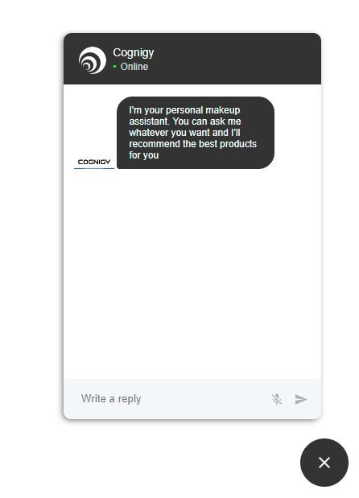

# Cognigy Web Chat

This repo contains a chat component which connects to the Cognigy brain, and which can be deployed easily on a website.

## Image


## Usage
To use the Cognigy Web Chat, simply:
- Download/clone all the files to your project.
- Add an empty div component with the class "cognigy-web-chat" and an id of "cognigy".
- Add `<link rel="stylesheet" type="text/css" href="index.css">` and `<link rel="stylesheet" type="text/css" href="rich_message_style.css">`
- At the bottom of the body tag (or at least after aforementioned div), insert these two scripts:
  ```
  <script src="cognigy-web-chat.js"></script>
  <script src="cognigy-web-client.js"></script>
  <script src="rich-messages.js"></script>
  ```
- Add the following script for minimal functionality:
```
 <script>
    const options = {
        baseUrl: 'host',
        user: 'username',
        apikey: 'apikey',
        channel: 'my-website',
        flow: 'flow',
        language: 'language',
        resetContext: true,
        resetState: true,
        handleOutput: function(output) {
            displayCognigyMessage(output);
        }
    };
    const inputValue = document.getElementById("cognigy-input").value;
    //Reset input value
    document.getElementById("cognigy-input").value = "";
    var client = new Cognigy.CognigyWebClient(options);

    client.connect()
    .catch(function(error) {
            console.log(error);
    });

    //Function used by postback buttons
    const handleCognigyMessage = (message) => {
        if (client && client.isConnected()) {
            const inputValue = document.getElementById("cognigy-input").value;
            document.getElementById("cognigy-input").value = "";

            client.sendMessage(inputValue, undefined);
        }
    }

    // listen on form submit event and use handleCognigyMessage function
    formElement.addEventListener("submit", () => {
        if (client && client.isConnected()) {
            const inputValue = document.getElementById("cognigy-input").value;
            document.getElementById("cognigy-input").value = "";

            client.sendMessage(inputValue, undefined);
        }
    }, false);
</script>
```

 ## Example

```
<head>
   <link rel="stylesheet" type="text/css" href="index.css">
   <link rel="stylesheet" type="text/css" href="rich_message_style.css">
</head>
  
<body>
    <div class="cognigy-web-chat" id="cognigy"></div>

    <script src="cognigy-web-chat.js"></script>
    <script src="cognigy-web-client.js"></script>
    <script src="rich-messages.js"></script>

    <script>
        let recording = false;
        const options = {
            baseUrl: 'host',
            user: 'username',
            apikey: 'apikey',
            channel: 'my-website',
            flow: 'flow',
            language: 'language',
            resetContext: true,
            resetState: true,
            handleOutput: function(output) {
                displayCognigyMessage(output);
            }
        };
        const inputValue = document.getElementById("cognigy-input").value;
        //Reset input value
        document.getElementById("cognigy-input").value = "";
        var client = new Cognigy.CognigyWebClient(options);

        client.connect()
        .catch(function(error) {
                console.log(error);
        });

		//Function used by postback buttons
		const handleCognigyMessage = (message) => {
			if (client && client.isConnected()) {
				const inputValue = document.getElementById("cognigy-input").value;
				document.getElementById("cognigy-input").value = "";
				if(message) {
					client.sendMessage(message, undefined);
				}
				else {
					client.sendMessage(inputValue, undefined);
				}
			}
		}

    	if (client && client.isConnected) {
			if (recordButton !== null) {
				recordButton.onclick = function () {
					recording = !recording;

					recordButton.style.backgroundImage = (recording) ? "url(./images/mic-animate.gif)" : "url(./images/mic.gif)";

					if (recording) {
						var beep = new Audio("https://www.freesound.org/data/previews/259/259703_4486188-lq.mp3");
						beep.play();
					}

					client.toggleRec();
				}
			}

			client.registerOnRecEnd( transcript => {
				handleDisplayRecording(transcript)
				client.sendMessage(transcript, undefined);
				console.log("what you said was: ", transcript);
			})
		}

        // listen on form submit event and use handleCognigyMessage function
        formElement.addEventListener("submit", () => {
            if (client && client.isConnected()) {
                const inputValue = document.getElementById("cognigy-input").value;
                document.getElementById("cognigy-input").value = "";

                client.sendMessage(inputValue, undefined);
            }
        }, false);
    </script>
</body>
 ```
